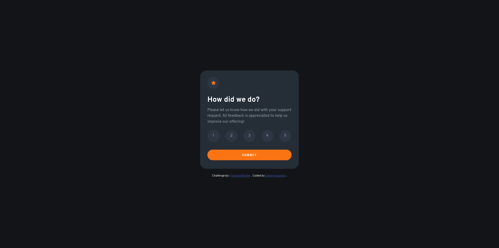

# Frontend Mentor - Interactive rating component solution

### Screenshot

### Links

- Solution URL: [Solution](https://www.frontendmentor.io/solutions/interactive-rating-component-PQUIenSB6G)
- Live Site URL: [Live Site](https://extraordinary-wisp-8f0c86.netlify.app/)

## My process

### Built with

- Semantic HTML5 markup
- CSS custom properties
- Flexbox

## Author

- Frontend Mentor - [@kadan-develop](https://www.frontendmentor.io/profile/kadan-develop)
